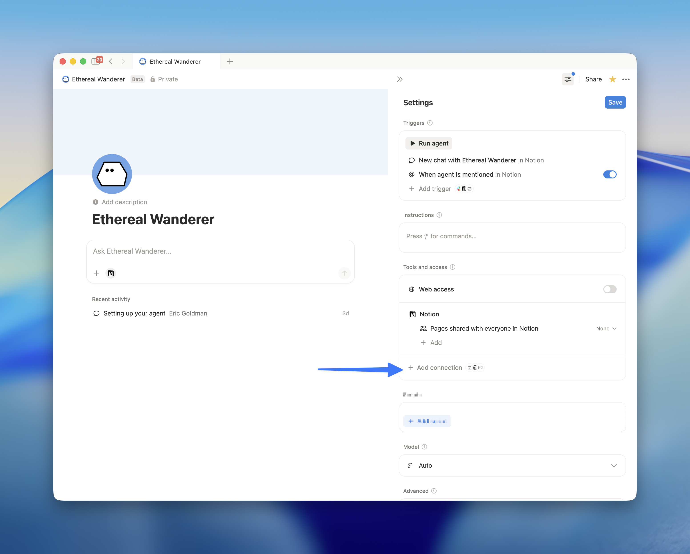

# Notion Workers [alpha]

A worker is a small Node/TypeScript program hosted by Notion. Workers have two capability types:

- **Tools** — callable functions for Notion custom agents
- **Syncs** — sync external data sources into Notion

> [!WARNING]
>
> This is an **extreme pre-release alpha** of Notion Workers. You probably
> shouldn't use it for anything serious just yet. Also, it'll only be helpful
> if you have access to Notion Custom Agents (and a workspace admin [opts in](https://www.notion.so/?target=ai)). We are still making breaking
> changes to Notion Workers CLI, templates, and more. We aim to minimize
> friction, but expect things to go wrong.

## Quick start

Install the `ntn` CLI and scaffold a new worker:

```shell
npm i -g ntn
ntn workers new
cd my-worker
```

## Tools quickstart

A tool gives your Notion agent a new ability. Here's a simple greeting tool in `src/index.ts`:

```ts
import { Worker } from "@notionhq/workers";
import { j } from "@notionhq/workers/schema-builder";

const worker = new Worker();
export default worker;

worker.tool("sayHello", {
	title: "Say Hello",
	description: "Returns a friendly greeting for the given name.",
	schema: j.object({
		name: j.string().describe("The name to greet."),
	}),
	execute: ({ name }) => `Hello, ${name}!`,
});
```

Deploy and add the tool to your agent:

```shell
ntn workers deploy
```



## Syncs quickstart

A sync pulls data from an external source into a Notion database. Here's a simple sync in `src/index.ts`:

```ts
import { Worker } from "@notionhq/workers";
import * as Builder from "@notionhq/workers/builder";
import * as Schema from "@notionhq/workers/schema";

const worker = new Worker();
export default worker;

const issues = worker.database("issues", {
	type: "managed",
	initialTitle: "Issues",
	primaryKeyProperty: "Issue ID",
	schema: {
		properties: {
			Title: Schema.title(),
			"Issue ID": Schema.richText(),
		},
	},
});

const issueTracker = worker.pacer("issueTracker", { allowedRequests: 10, intervalMs: 1000 });

worker.sync("issuesSync", {
	database: issues,
	execute: async () => {
		await issueTracker.wait();
		const items = await fetchIssues(); // your data source
		return {
			changes: items.map((issue) => ({
				type: "upsert" as const,
				key: issue.id,
				properties: {
					Title: Builder.title(issue.title),
					"Issue ID": Builder.richText(issue.id),
				},
			})),
			hasMore: false,
		};
	},
});
```

Deploy and your sync runs automatically on a schedule (default: every 30 minutes):

```shell
ntn workers deploy
ntn workers sync status
```

## Tools reference

### Schema builder

Use the schema builder (`j`) to define tool inputs. It auto-sets `required` and `additionalProperties`, and provides TypeScript type inference:

```ts
import { j } from "@notionhq/workers/schema-builder";

schema: j.object({
	query: j.string().describe("Search query"),
	limit: j.number().describe("Max results").nullable(),
})
```

Use `.nullable()` to mark a field as optional. Use `.describe()` to tell the agent what the field is for.

### Output schema

Optionally define the shape of what your tool returns:

```ts
worker.tool("search", {
	title: "Search",
	description: "Search for items",
	schema: j.object({
		query: j.string().describe("Search query"),
	}),
	outputSchema: j.object({
		results: j.array(j.string()),
	}),
	execute: async ({ query }) => {
		return { results: [] };
	},
});
```

### Execute function

The `execute` function receives the validated input and a context object:

```ts
execute: async (input, context) => {
	// context.notion — authenticated Notion SDK client
	const { query, limit = 10 } = input;
	return { results: [] };
}
```

## Syncs reference

### Databases and schema

Declare databases with `worker.database()` and define schemas with `Schema` helpers. Build property values with `Builder`:

```ts
import * as Schema from "@notionhq/workers/schema";
import * as Builder from "@notionhq/workers/builder";

const records = worker.database("records", {
	type: "managed",
	initialTitle: "My Data",
	primaryKeyProperty: "ID",
	schema: {
		properties: {
			Name: Schema.title(),
			ID: Schema.richText(),
		},
	},
});

// In execute, return changes with matching property values:
properties: {
	Name: Builder.title("Item name"),
	ID: Builder.richText("item-1"),
}
```

`primaryKeyProperty` specifies which property to use as the unique key for each record.

### Sync modes

**Replace** (`mode: "replace"`) — each sync cycle returns the full dataset. After the final `hasMore: false`, any records not seen are deleted:

```ts
worker.sync("teamsSync", {
	database: teams,
	mode: "replace",
	execute: async (state) => {
		const page = state?.page ?? 1;
		await myApi.wait();
		const { items, hasMore } = await fetchPage(page, 100);
		return {
			changes: items.map((item) => ({
				type: "upsert" as const,
				key: item.id,
				properties: { Name: Builder.title(item.name), ID: Builder.richText(item.id) },
			})),
			hasMore,
			nextState: hasMore ? { page: page + 1 } : undefined,
		};
	},
});
```

**Incremental** (`mode: "incremental"`) — each cycle returns only what changed since the last run. Records not mentioned are left unchanged. Deletions must be explicit:

```ts
worker.sync("eventsSync", {
	database: events,
	mode: "incremental",
	execute: async (state) => {
		await myApi.wait();
		const { upserts, deletes, nextCursor } = await fetchChanges(state?.cursor);
		return {
			changes: [
				...upserts.map((item) => ({
					type: "upsert" as const,
					key: item.id,
					properties: { Name: Builder.title(item.name), ID: Builder.richText(item.id) },
				})),
				...deletes.map((id) => ({ type: "delete" as const, key: id })),
			],
			hasMore: Boolean(nextCursor),
			nextState: nextCursor ? { cursor: nextCursor } : undefined,
		};
	},
});
```

Use `replace` for smaller datasets (<1k records). Use `incremental` for larger datasets or when the API supports change tracking.

### Pagination

Syncs run as a chain of `execute` calls within a sync cycle:

1. Return changes with `hasMore: true` and a `nextState` value
2. The runtime calls `execute` again with that state
3. Continue until you return `hasMore: false`

`nextState` can be any serializable value — a cursor string, page number, timestamp, or object. Start with batch sizes of ~100 changes.

### Schedule

By default syncs run every 30 minutes. Set `schedule` to an interval like `"15m"`, `"1h"`, `"1d"` (min `"1m"`, max `"7d"`), `"continuous"`, or `"manual"`:

```ts
worker.sync("fastSync", {
	database: myDb,
	schedule: "5m",
	// ...
});
```

### Relations

Two databases can relate to each other using `Schema.relation()` and `Builder.relation()`:

```ts
const projects = worker.database("projects", {
	type: "managed",
	initialTitle: "Projects",
	primaryKeyProperty: "Project ID",
	schema: {
		properties: {
			Name: Schema.title(),
			"Project ID": Schema.richText(),
		},
	},
});

const tasks = worker.database("tasks", {
	type: "managed",
	initialTitle: "Tasks",
	primaryKeyProperty: "Task ID",
	schema: {
		properties: {
			Name: Schema.title(),
			"Task ID": Schema.richText(),
			Project: Schema.relation("projectsSync", {
				twoWay: true,
				relatedPropertyName: "Tasks",
			}),
		},
	},
});

worker.sync("projectsSync", {
	database: projects,
	execute: async () => { /* ... */ },
});

worker.sync("tasksSync", {
	database: tasks,
	execute: async () => {
		const items = await fetchTasks();
		return {
			changes: items.map((task) => ({
				type: "upsert" as const,
				key: task.id,
				properties: {
					Name: Builder.title(task.name),
					"Task ID": Builder.richText(task.id),
					Project: [Builder.relation(task.projectId)],
				},
			})),
			hasMore: false,
		};
	},
});
```

### Sync CLI commands

```shell
ntn workers sync status              # live-updating status
ntn workers sync trigger <key> --preview  # preview output without writing to the database
ntn workers sync trigger <key>           # trigger a real sync immediately
ntn workers sync state reset <key>   # restart from scratch
ntn workers capabilities disable <key>  # pause a sync
ntn workers capabilities enable <key>   # resume a sync
```

> [!NOTE]
> Deploying does **not** reset sync state — syncs resume from their last cursor position. Use `ntn workers sync state reset <key>` to restart from scratch.

## Authentication & secrets

### Secrets

Store API keys and credentials:

```shell
ntn workers env set API_KEY=your-secret
```

For local development, pull secrets to a `.env` file:

```shell
ntn workers env pull
```

Access them via `process.env`:

```ts
const apiKey = process.env.API_KEY;
```

### OAuth

For services requiring user authorization (GitHub, Google, etc.):

```ts
const githubAuth = worker.oauth("githubAuth", {
	name: "github-oauth",
	authorizationEndpoint: "https://github.com/login/oauth/authorize",
	tokenEndpoint: "https://github.com/login/oauth/access_token",
	scope: "repo user",
	clientId: process.env.GITHUB_CLIENT_ID ?? "",
	clientSecret: process.env.GITHUB_CLIENT_SECRET ?? "",
});
```

After deploying, configure your OAuth provider's redirect URL:

```shell
ntn workers oauth show-redirect-url
ntn workers oauth start githubAuth
```

Use the token in your tools:

```ts
worker.tool("getGitHubRepos", {
	title: "Get GitHub Repos",
	description: "Fetch user's GitHub repositories",
	schema: j.object({}),
	execute: async () => {
		const token = await githubAuth.accessToken();
		const response = await fetch("https://api.github.com/user/repos", {
			headers: { Authorization: `Bearer ${token}` },
		});
		return response.json();
	},
});
```

## What you can build

<details open>
<summary><strong>Sync external data into Notion</strong></summary>

```ts
const customers = worker.database("customers", {
	type: "managed",
	initialTitle: "Customers",
	primaryKeyProperty: "Customer ID",
	schema: {
		properties: {
			Name: Schema.title(),
			"Customer ID": Schema.richText(),
			Email: Schema.richText(),
		},
	},
});

const crm = worker.pacer("crm", { allowedRequests: 10, intervalMs: 1000 });

worker.sync("customersSync", {
	database: customers,
	execute: async (state) => {
		const page = state?.page ?? 1;
		await crm.wait();
		const { customers: items, hasMore } = await fetchCustomers(page);
		return {
			changes: items.map((c) => ({
				type: "upsert" as const,
				key: c.id,
				properties: {
					Name: Builder.title(c.name),
					"Customer ID": Builder.richText(c.id),
					Email: Builder.richText(c.email),
				},
			})),
			hasMore,
			nextState: hasMore ? { page: page + 1 } : undefined,
		};
	},
});
```

</details>

<details>
<summary><strong>Give agents a phone with Twilio</strong></summary>

```ts
worker.tool("sendSMS", {
	title: "Send SMS",
	description: "Send a text message to a phone number",
	schema: j.object({
		to: j.string().describe("Phone number in E.164 format"),
		message: j.string().describe("Message to send"),
	}),
	execute: async ({ to, message }) => {
		const response = await fetch(
			`https://api.twilio.com/2010-04-01/Accounts/${process.env.TWILIO_ACCOUNT_SID}/Messages.json`,
			{
				method: "POST",
				headers: {
					Authorization: `Basic ${Buffer.from(
						`${process.env.TWILIO_ACCOUNT_SID}:${process.env.TWILIO_AUTH_TOKEN}`,
					).toString("base64")}`,
					"Content-Type": "application/x-www-form-urlencoded",
				},
				body: new URLSearchParams({
					To: to,
					From: process.env.TWILIO_PHONE_NUMBER ?? "",
					Body: message,
				}),
			},
		);

		if (!response.ok) throw new Error(`Twilio API error: ${response.statusText}`);
		return "Message sent successfully";
	},
});
```

</details>

<details>
<summary><strong>Post to Discord, WhatsApp, and Teams</strong></summary>

```ts
worker.tool("postToDiscord", {
	title: "Post to Discord",
	description: "Send a message to a Discord channel",
	schema: j.object({
		message: j.string().describe("Message to post"),
	}),
	execute: async ({ message }) => {
		const response = await fetch(process.env.DISCORD_WEBHOOK_URL ?? "", {
			method: "POST",
			headers: { "Content-Type": "application/json" },
			body: JSON.stringify({ content: message }),
		});

		if (!response.ok) throw new Error(`Discord API error: ${response.statusText}`);
		return "Posted to Discord";
	},
});
```

</details>

<details>
<summary><strong>Turn a Notion page into a podcast with ElevenLabs</strong></summary>

```ts
worker.tool("createPodcast", {
	title: "Create Podcast from Page",
	description: "Convert page content to audio using ElevenLabs",
	schema: j.object({
		content: j.string().describe("Page content to convert"),
		voiceId: j.string().describe("ElevenLabs voice ID"),
	}),
	execute: async ({ content, voiceId }) => {
		const response = await fetch(
			`https://api.elevenlabs.io/v1/text-to-speech/${voiceId}`,
			{
				method: "POST",
				headers: {
					"xi-api-key": process.env.ELEVENLABS_API_KEY ?? "",
					"Content-Type": "application/json",
				},
				body: JSON.stringify({ text: content, model_id: "eleven_monolingual_v1" }),
			},
		);

		if (!response.ok) throw new Error(`ElevenLabs API error: ${response.statusText}`);
		const audioBuffer = await response.arrayBuffer();
		return `Generated ${audioBuffer.byteLength} bytes of audio`;
	},
});
```

</details>

<details>
<summary><strong>Get live stocks, weather, and traffic</strong></summary>

```ts
worker.tool("getWeather", {
	title: "Get Weather",
	description: "Get current weather for a location",
	schema: j.object({
		location: j.string().describe("City name or zip code"),
	}),
	execute: async ({ location }) => {
		const response = await fetch(
			`https://api.openweathermap.org/data/2.5/weather?q=${encodeURIComponent(location)}&appid=${process.env.OPENWEATHER_API_KEY}&units=metric`,
		);

		if (!response.ok) throw new Error(`Weather API error: ${response.statusText}`);

		const data = await response.json();
		return `${data.name}: ${data.main.temp}°C, ${data.weather[0].description}`;
	},
});
```
</details>

## Helpful CLI commands

```shell
# Deploy your worker to Notion
ntn workers deploy

# Test a tool locally
ntn workers exec <toolName> --local -d '{"key": "value"}'

# Monitor sync status (live-updating)
ntn workers sync status

# Preview sync output without writing to the database
ntn workers sync trigger <syncKey> --preview

# Trigger a real sync immediately (writes to the database, bypasses schedule)
ntn workers sync trigger <syncKey>

# Reset sync state (restart from scratch)
ntn workers sync state reset <syncKey>

# List all capabilities
ntn workers capabilities list

# Pause / resume a sync
ntn workers capabilities disable <syncKey>
ntn workers capabilities enable <syncKey>

# Manage authentication
ntn login
ntn logout

# Store API keys and secrets
ntn workers env set API_KEY=your-secret

# View execution logs
ntn workers runs logs <runId>

# Start OAuth flow
ntn workers oauth start <oauthName>

# Show OAuth redirect URL (set this in your provider's app settings)
ntn workers oauth show-redirect-url

# Display help for all commands
ntn --help
```

## Local development

```shell
npm run check # type-check
npm run build # emit dist/
```

Store secrets in `.env` for local development:

```shell
ntn workers env pull
```

## Have a question?

Join the [Notion Dev Slack](https://join.slack.com/t/notiondevs/shared_invite/zt-3u9oid9q8-HLUBmMVWYK~g9HFo4U4raA)!
